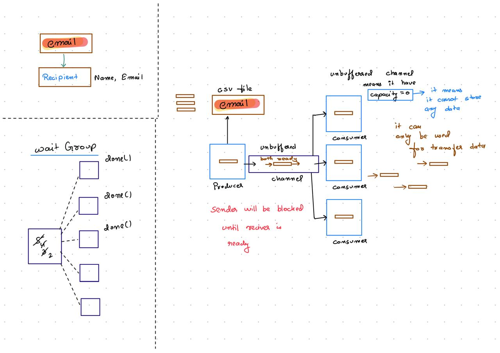

### Architectural Primitives:
1. **The Producer (`producer.go`):** Streams database matrices row-by-row using `csv.Reader.Read()` instead of consuming memory with bulk reads, optimizing spatial memory allocations to $O(1)$.
2. **The Pipe Channel (`main.go`):** An unbuffered Go synchronization channel (`chan Recipient`). Acting as a zero-capacity conduit, it enforces block-level backpressure—the producer cannot read a new row until an active worker becomes available to consume the previous one.
3. **The Worker Pool (`consumer.go`):** Parallel worker routines initialized simultaneously via tracking parameters. Each worker reads from the centralized channel, constructs independent memory blocks, executes templates, and dispatches to the local server.
4. **The Synchronization Gate (`main.go`):** Managed via a `sync.WaitGroup` to block main context termination until every active routine reports `Done()`.


---

## 🚀 Iterative Engineering Upgrades

This engine was systematically transformed from a simple local script into a production-hardened concurrent backend utility.

### 🔄 Evolution Matrix
| Feature Block | Version 1.0 (Initial Draft) | Version 2.0 (Production Level) | Impact & Structural Benefit |
| :--- | :--- | :--- | :--- |
| **Messaging Type** | Hardcoded text block strings inside source logic | Dynamic native HTML/Text processing (`html/template`) | Allows professional, customized formatting templates using dynamic client-side runtime values. |
| **Authentication** | Unauthenticated local relays via `nil` credentials | Scoped environmental mapping over network ports | Seamless workflow transition: tests locally inside **Mailpit** without exposing real web passwords. |
| **Resource Efficiency** | Loop-bound environment variables & continuous parsing | Config parameters and template compilation cached *once* outside loops | Drastically reduces system overhead by eliminating redundant OS file system I/O execution calls. |
| **Fault Isolation** | Unprotected goroutines; unexpected runtime panics crashed the process | Embedded local `recover()` deferments inside individual workers | High availability. A malformed email row or target syntax error cannot crash the global distribution engine. |

---

## 🗂️ Project Directory Layout

Based on your repository, here is the clean, exact layout mapping your code files:
```text
├── consumer.go        # Parallel worker routine definitions & SMTP pipeline
├── email.tmpl         # Raw template layout with dynamic variable injection fields
├── emails.csv         # Target mailing registry matrix
├── go.mod             # Module configuration
├── info.md            # Project technical information notes
├── main.go            # Central orchestrator & wait-group synchronizer
└── producer.go        # Low-overhead CSV streaming pipeline
```

## Operations & Management



## 🎮 Execution & Run Instructions

Follow this clear, step-by-step workflow to get your local SMTP server active on Docker and launch the Go bulk dispatcher pipeline.

### Step 1: Launch Docker Desktop
Before running any container commands, ensure that your local container runtime is active.
* Open the **Docker Desktop** application on your local computer.
* Wait a brief moment until the system indicator light in the bottom corner of the application interface turns green, indicating **"Engine Running"**.

### Step 2: Initialize the Mailpit Container via Terminal
Open your terminal or command prompt interface and execute the following deployment configuration command:

```bash
docker run -d \
  --restart unless-stopped \
  --name=mailpit \
  -p 8025:8025 \
  -p 1025:1025 \
  axllent/mailpit
```
### Step 3: Verify the Interface on Localhost
Once the container status registers as active inside Docker Desktop, you can access the visual mail tracker.

-Open your web browser.

-Navigate to your local host address at: http://localhost:8025

-This interface will display all inbound emails captured live by the system.

### Step 4: Execute the Go Engine
With Mailpit successfully hosting your mock server on localhost, return to your project root directory in your terminal and compile the orchestration script files together:
```bash 
go run .
```

## Working Profe


### docker setup


### mail pit interface on loacl host before execting the mails


### execution of mail from the terminal 


### mail pit interface on loacl host after execting the mails

