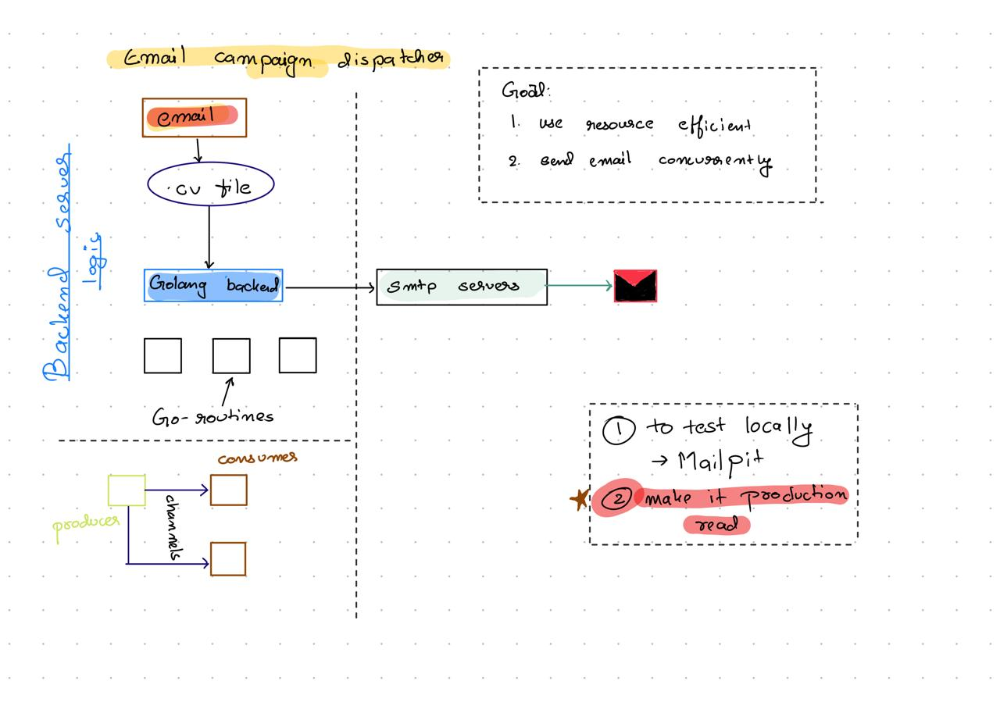

 Email  Campaign Dispatcher (Go)

 A high-performance, concurrent bulk email dispatcher built entirely in Go with zero third-party dependencies. This project serves as a lightweight, open-source alternative to paid email marketing services like Mailchimp, capable of safely dispatching up to 500 emails in under a minute using Gmail's SMTP server or a local development environment.

 ## Core Architecture
The system uses a classic Producer-Consumer pattern optimized by Go's native concurrency model to stream, format, and dispatch mail without memory spikes:

Producer (producer.go): Reads recipient data line-by-line from a .csv target file to ensure constant memory overhead.

Channel (main.go): An unbuffered pipe that hands data safely off to workers, establishing natural backpressure.

Consumers (consumer.go): A configurable pool of concurrent worker goroutines that parse templates, handle runtime stability, and execute secure SMTP commands.

Synchronization (main.go): A sync.WaitGroup ensures the orchestrator stays open until all workers process their queues cleanly.



## Code Evolution & Upgrades
This project demonstrates a progression from a simple local script to a resilient, production-grade background processor:

1. Hardcoded String Messaging $\rightarrow$ Dynamic HTML Templates

-Original: Initial manual testing sent a basic formatted plain-text string.
-Upgraded: Incorporated Go’s native html/template package to read from an email.tmpl file, generating personalized contextual formatting per recipient.

2. Local Mock Testing $\rightarrow$ Authenticated Production Mail

-Original: Local validation was done against a mock server (Mailpit) which used unauthenticated connections (nil authentication).
-Upgraded: Updated the runtime worker to utilize smtp.PlainAuth() leveraging encrypted environment variables (.env) to authenticate over real external TLS/SSL relays (Gmail port 587).

3. Loop Safety & Panic Resilience
-Loop Efficiency: Critical configurations (like environmental configurations and template parsing) are loaded efficiently outside processing loops to eliminate redundant I/O operations.
-Fault Tolerance: Implemented panic handling (recover()) inside worker goroutines. If a specific routine encounters an unexpected execution failure or bad malformed email layout, the error is isolated. The thread recovers safely without crashing the entire central distribution engine.

## How To Manage & Operate It
Prerequisites
-Go installed (version 1.18 or higher recommended).
-A Gmail account with App Passwords enabled.

1. File Structure Layout
Your project environment should look like this:
```bash
├── config/          # Environment loader configuration
├── .env             # Protected local credentials
├── main.go          # Central orchestrator
├── producer.go      # CSV data streamer
├── consumer.go      # Concurrency workers & SMTP handler
├── email.tmpl       # HTML email layout
└── emails.csv       # Recipient data matrix
```

## Configuration Setup
Create a .env file in the root directory:
```bash
SMTP_HOST=smtp.gmail.com
SMTP_PORT=587
SMTP_EMAIL=example@gmail.com// here add your gmail
SMTP_PASSWORD=**** **** **** **** //here add your smtp password
```

🔐 Comprehensive Guide: Setting Up Gmail SMTP Relays

By default, Google blocks standard applications from connecting to its SMTP relays using your primary account password to protect against credential theft. To allow your Go Engine to securely authenticate and send mail, you must generate a scoped App Password.

Step 1: Enable 2-Step Verification
Google requires your account to have multi-factor authentication active before it allows App Password generation.

-Go to your Google Account Console.

-On the left navigation panel, click Security.

-Scroll down to the "How you sign in to Google" section.

-Click on 2-Step Verification and follow the prompts to connect your phone number or authenticator app. Ensure it status changes to ON.

Step 2: Navigate to App Passwords
Once 2-Step Verification is active, the option to generate isolated application keys becomes available.

Return to the Security tab in your Google Account.

In the search bar at the top of your Google Account page, type "App passwords" and click on the matching setting result.

(Alternatively, if available, scroll down to the bottom of the "2-Step Verification" settings screen to locate the App passwords section).

You will be prompted to re-enter your primary password to verify your identity.

Step 3: Generate the Unique 16-Character Key
Under the "Select app" dropdown menu, choose Other (Custom name).

Type a recognizable name for your workspace deployment, such as Go-Mailing-Engine or Email-Campaign-Dispatcher.

-Click the Generate button.

A modal popup window will display a unique 16-character code (typically presented in 4 blocks of 4 characters, e.g., abcd efgh ijkl mnop).

[!WARNING]
Copy this 16-character password immediately. Google will only show this code to you once. If you close the window before copying it, you will have to delete the app mapping profile and generate a completely new one. Do not include spaces when pasting it into your system configuration.

Step 4: Update Your Environment Variables
Open your project's local hidden configuration file (.env) and inject the credentials exactly as shown below:
```bash
# Your primary sender email address
SMTP_EMAIL=your-actual-email@gmail.com

# The 16-character generated code (Do NOT include spaces)
SMTP_PASSWORD=abcdefghijklmnop

# The immutable standard Google production mail server destination route
SMTP_HOST=smtp.gmail.com
```
## Prepare Target Lists & Templates
Save your mailing target matrix as emails.csv in the project root:
```bash
Name,Email
John Doe,johndoe@example.com
Jane Smith,janesmith@example.com
```
## Customize your content message markup within email.tmpl:
```bash
To: {{.Email}}
Subject: Hello, {{.Name}}

Hi {{.Name}} ji,
 Good morning

Thanks,
The Mritunjay Campaign team.
```
## Execution Commands
To run the optimized pipeline, execute:
```bash 
go run main.go producer.go consumer.go
```

## Performance Controls
Built-in Rate Throttling
Inside consumer.go, each worker utilizes a targeted time.Sleep(50 * time.Millisecond) buffer delay. This ensures the 5 parallel processing workers do not flood connections or run into incoming firewall flags on enterprise relays (such as Gmail's daily/hourly outbound quotas).

System Safety Gates
If a specific delivery attempt hits a critical runtime failure (such as a parsing mismatch or dropped TCP connection packet), the worker isolates the failure through its internal panic interceptor. It logs the explicit incident to stderr and safely continues to the next item on the channel queue, ensuring the larger pipeline remains operational.

## Operations & Management
here is a digram explaing how the internal logic works 
